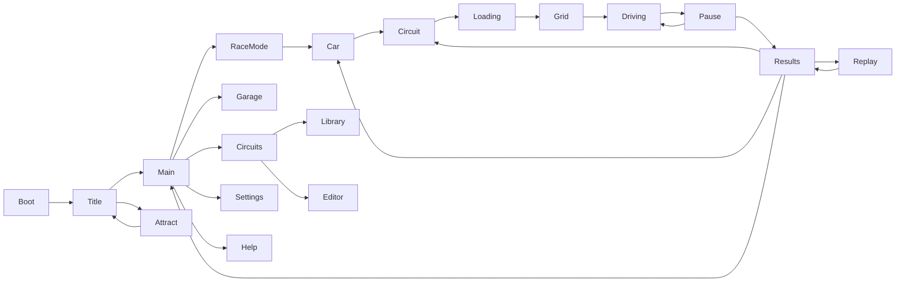

# Console presentation follow-up — work and acceptance record

**Manual-test build; acceptance pending.** At the user's request, the current work is compiled and committed for hands-on testing without finishing the performance matrix. This report supersedes the presentation/UI requirements of `PS2-SIMCADE-REPORT.md`; that earlier report remains the record of the previous build. Simulation equations and the browser fixture remain unchanged.

## Implementation

The default pairing remains the procedural Ferrari 296 GT3 at Spa. The frontend now uses an original 448-line layout and Rajdhani OFL typography, with boot/title/attract, race mode, car/setup/paint/rims, circuit/map/elevation/record, actual preparation stages, grid countdown, race HUD, pause, time sheet and last-lap replay. Existing garage, library, controls/remapping, settings, Help and editor remain available. Synthesized menu sounds distinguish focus, confirm, back and error. The editor bypasses the output filter.

The SD world is 640×448 with 4:3 or anamorphic 16:9 presentation. Authentic UI renders to the same 640×448 composition; Sharp UI is optional. 480i renders a 640×224 world field and preserves alternating output lines, with a three-tap vertical deflicker filter at nominal 59.94 fields/s. Optional CRT/composite reduces chroma bandwidth with a mild mask; it is an approximation, not electrical NTSC emulation. Default framebuffer colour is 24-bit; optional RGB555 dithering is separate from texture palettes. Enhanced 720p and Native remain available.

`tools/build_ps2_textures.py` uses the already-present Pillow 12.3.0 runtime. `tests/build_asset_sources.gd` generates original art and converts the licensed HDR sky; the Python build arranges licensed needle photographs into an original pine card, quantizes all 21 outputs and records sizes, colours, nominal GS-style storage and source/output SHA-256 hashes in `assets/ps2/texture-manifest.json`. Modern Godot expands indexed textures at import; these are appearance/budget targets, not hardware CLUT emulation. Runtime remains fully offline.

## Research and downloads

See [PS2-REFERENCE.md](PS2-REFERENCE.md) for sourced findings, the frontend flow diagram, reference provenance and comparison-round logs. [THIRD-PARTY.md](../THIRD-PARTY.md) records every font, photograph, legal text and study-image download. Font OFL and photograph CC0 legal texts accompany the executable. No addon, Blender, extracted game assets or third-party game code was incorporated. Proprietary polycount/effect assumptions that lack primary evidence are explicitly labelled as unknown.

| Download | License / author | Use |
|---|---|---|
| Rajdhani Medium/Bold, pinned Google Fonts revision | OFL 1.1; Indian Type Foundry | Original menus, HUD, editor |
| Kloofendal partly-cloudy HDR sky | CC0; Greg Zaal, Jarod Guest | 256×128 RGB555 sky/environment maps |
| Pine Tree 01 twig diffuse/alpha | CC0; Rob Tuytel, Rico Cilliers | Original 128×256, 16-colour foliage arrangement |
| OFL and CC0 legal texts | Respective unmodified legal texts | Packaged notices |
| Seven GT4/NFSU2 study images | Copyrighted; no redistribution license | Ignored local comparisons only |

Existing CC0 asphalt/grass/gravel/concrete photographs are reused. No new Python package was downloaded: the existing Pillow 12.3.0 runtime is pinned in the build requirement. The complete ledger contains direct URLs and source hashes.

The research distinguishes a 24-bit framebuffer from palettized textures, a field from a complete frame, and a hardware budget from a documented per-game measurement. The default therefore avoids forced colour banding and always-on scanlines. GT4 did not contain Spa; reference panels use analogous circuit views, and the NFSU2 storefront capture settings are unknown. Those limitations are printed on the comparison sheets.

## UI flow and visual evidence

Back returns one level; editor departures retain the existing dirty guard. Preparing a run validates the actual circuit, resets the vehicle and initializes session timing/view. The loading screen reports completed work and can be cancelled. Replay consumes the immutable completed ghost without advancing physics.

Eight compare/fix/rerender rounds are recorded in [the research log](PS2-REFERENCE.md#comparison-rounds-and-acceptance). Round 8 contains 80 captures per backend: eight Spa locations × chase/hood × Afternoon/Afterhours, three showroom angles under each light, 19 UI/editor pages at each required window size, and four output variants. Every main page and location was visually inspected; selected full-size and paired images supplement the complete contact sheets. Before images are round 1; views absent in round 1 are labelled accordingly.

Local, git-ignored galleries: [Forward+ before/current/reference sheets](../tests/compare/round-8/forward/sheets/index.html), [OpenGL sheets](../tests/compare/round-8/gl/sheets/index.html). Each gallery links every full-size sheet; originals are in its parent folder. These are local evidence, not licensed redistributable game assets.

| Evidence | Forward+ contact sheets |
|---|---|
| Afternoon: all eight locations and showroom | [1](../tests/compare/round-8/forward/sheets/afternoon-contact-1.png), [2](../tests/compare/round-8/forward/sheets/afternoon-contact-2.png), [3](../tests/compare/round-8/forward/sheets/afternoon-contact-3.png), [4](../tests/compare/round-8/forward/sheets/afternoon-contact-4.png) |
| Afterhours: all eight locations and showroom | [1](../tests/compare/round-8/forward/sheets/afterhours-contact-1.png), [2](../tests/compare/round-8/forward/sheets/afterhours-contact-2.png), [3](../tests/compare/round-8/forward/sheets/afterhours-contact-3.png), [4](../tests/compare/round-8/forward/sheets/afterhours-contact-4.png) |
| Every screen at 1280×800 | [1](../tests/compare/round-8/forward/sheets/ui-1280x800-contact-1.png), [2](../tests/compare/round-8/forward/sheets/ui-1280x800-contact-2.png), [3](../tests/compare/round-8/forward/sheets/ui-1280x800-contact-3.png), [4](../tests/compare/round-8/forward/sheets/ui-1280x800-contact-4.png) |
| Every screen at 1920×1080 | [1](../tests/compare/round-8/forward/sheets/ui-1920x1080-contact-1.png), [2](../tests/compare/round-8/forward/sheets/ui-1920x1080-contact-2.png), [3](../tests/compare/round-8/forward/sheets/ui-1920x1080-contact-3.png), [4](../tests/compare/round-8/forward/sheets/ui-1920x1080-contact-4.png) |

Screens covered: boot, title, main, race mode, car, circuit, circuits hub, loading, grid, drive, pause, results, replay, attract, garage, settings, Help, library and editor. Comparison poses are staged; dynamic validity is established separately below.

## Benchmark method

`--flow-benchmark` sends keyboard and controller events through `Input.parse_input_event`, then the application's ordinary routing/controls/physics. The test visits boot, title, main, race mode, car, circuit, real loading/grid, a full valid lap, pause, results and main, and opens/closes the secondary menus. Synthetic device 31 avoids confusing test events with real devices; hardware polling and focus-loss cancellation are isolated only while a test driver owns input. This does not validate a physical controller.

`--performance` visits the whole lap without teleporting the car: four actual 240 Hz physics steps and a presented GPU frame per sample, corresponding to a 60 Hz simulation workload. Vsync is disabled to measure available headroom; elapsed wall frame time includes CPU work and GPU presentation. A 60-frame setup warmup is excluded and disclosed. Mean, p99, mean of the slowest 1%, maximum and count over 16.667 ms are recorded. It is an uncapped workload measurement, not a claim that Windows never schedules another task or that a vblank-locked run has zero timing variation. Both renderers run sequentially, not concurrently.

## Playability results

| 296 / Spa run | Lap | Kemmel max | Peak body slip | Off-track steps / contacts |
|---|---:|---:|---:|---:|
| Simulation, analog driver | 5:00.029 | 160.03 km/h | 5.27° | 0 / 0 |
| Simcade, analog driver | 4:59.650 | 160.03 km/h | 5.20° | 0 / 0 |
| Simcade, digital keyboard | 5:00.792 | 161.98 km/h | 5.18° | 0 / 0 |
| Simcade, scripted human intervention | 4:58.933 | 162.02 km/h | 4.97° | 0 / 0 |

All four laps are valid. The intervention delays braking by 4 m into La Source/Bus Stop and applies full throttle exiting Raidillon (823 physics ticks); no spin occurred. The driver deliberately targets about 45 m/s on the straights. These five-minute laps verify stability and flow, not competitive Spa pace or the 296's unrestricted top speed. Raw evidence: `tests/showcase/laps.json`.

The source and both exported full-feature runs each passed 247 checks with empty stderr, including 86 flow checks, background-writer/replay immutability and record-selection history checks. In every run, controller-only and keyboard-only journeys completed valid 4:59.650 / 5:00.792 laps with zero off-track steps/contacts, then reached pause/results/main. Measured preparation stages are below; no stage exceeded 16.667 ms. That timing assertion is retained on the target RTX 4080; software-rendered CI records finite stage measurements without imposing this machine's speed target.

| Build / input | Validation ms | Vehicle ms | Timing ms |
|---|---:|---:|---:|
| Source / controller | 3.142 | 7.563 | 0.032 |
| Source / keyboard | 2.138 | 7.683 | 0.023 |
| Export Forward+ / controller | 2.533 | 6.489 | 0.021 |
| Export Forward+ / keyboard | 2.577 | 7.504 | 0.016 |
| Export OpenGL / controller | 1.956 | 6.141 | 0.022 |
| Export OpenGL / keyboard | 2.845 | 7.447 | 0.021 |

| Final regression suite | Result |
|---|---|
| Browser physics parity | PASS; maximum position error 2.206e-7 m, RPM error 7.015e-8 |
| Native handling | 24 checks, zero failures |
| Simulation dynamics | 34 checks, zero failures |
| Simcade dynamics | 87 checks, zero failures |
| Four-circuit laps, each handling model | 4 + 4 valid laps, zero off-track steps/contacts |
| Circuit import | 9 checks, zero failures |
| Spatial/exhaustive validation equivalence | 103 cases, zero differences |
| 296/Spa handling and intervention laps | 4 valid laps, zero off-track steps/contacts |
| Source features | 247 checks, zero failures |
| Exported Forward+ features | 247 checks, zero failures |
| Exported OpenGL features | 247 checks, zero failures |
| Fresh-default exported title | 7 checks, zero failures |

Completed suite stderr files are empty. Headless logs use `tests/logs/release-*.log/.err`; final source/export logs use `acceptance-source-final`, `acceptance-export-{forward_plus,gl_compatibility}` and `acceptance-title`. Flow results are `tests/showcase/flow-results.json` (source) and `release-flow-{forward_plus,gl_compatibility}.json` (export). All 21 baked output hashes agree with the texture manifest. The CI workflow was updated but no remote CI result is claimed.

## Performance and regression results

Final performance acceptance is pending. The interrupted exported matrix passed the three Afternoon cases, but the first Afterhours trace included 3,115 extra frames with the simulation stopped and a 140.87 ms maximum. That sample is rejected, not counted as a clean pass. Evidence is retained under `tests/showcase/interrupted-release`. Automated laps now accept only tagged test-driver events and explicitly reject pause/menu interruptions. The 247-check results above predate this final test-isolation change; its full suite and replacement performance matrix remain unrun at the user's request. The manual-test build receives compilation and a bounded title-launch check.

Raw local captures/logs are ignored under `tests/compare`, `tests/showcase` and `tests/logs`. Source or export success is not inferred from the other. No benchmark is marked passed merely because a process launched or its screenshot list was written.

The retained failure history matters: repeated flare terrain projections and synchronous finish-line recording work caused the first Forward+ failure (35.25 ms slowest-1% mean, 172.99 ms maximum). Cached terrain sampling and immutable serial background writes removed those stalls. The first complete OpenGL matrix then exposed a 165.12 ms first-use ghost frame. Offscreen ghost/skid preparation reduced the affected repeat lap to 9.02 ms slowest-1% mean / 11.04 ms maximum, with no frames over 16.667 ms. Original matrices/traces remain under `tests/showcase/prewarm-before`; the final table will use the delivered executable.

The unchanged Simulation/Simcade equations and five main feel controls remain documented in [the original handling report](PS2-SIMCADE-REPORT.md#five-principal-feel-controls): the 13° peak-end angle, 0.87 sliding-grip floor, 0.60 load-sensitivity scale, 3.5 progressive yaw-damping gain and 0.70 assisted-steering peak fraction. This follow-up changes presentation, navigation and persistence scheduling, not those constants.

## Ranked remaining authenticity differences

1. **Circuit dressing:** the repeated trees, fences and buildings are simpler and cleaner than GT4's individually authored environments. The SD raster, card foliage, fog and modest geometry read as period console rendering; bespoke art density still differs.
2. **Night reflections:** authored wet-light pools, additive halos and temporal persistence capture the platform's broad effect vocabulary. NFSU2 has richer environment-specific reflection content and more varied urban lighting; Spa remains a rural circuit.
3. **296 surface/model detail:** 11,546 mesh triangles preserve the recognizable body/aero, animated wheels, brakes and suspension, but seams/interior details and paint reflection content are less intricate. It is an original procedural model, not manufacturer or game geometry.
4. **Frontend polish:** the navigation, safe margins, low-resolution typography and brief transitions fit the period. The retained technical garage/editor and synthesized sound palette are more utilitarian than a large commercial racer's presentation.
5. **Output approximation:** alternating fields, deflicker, chroma bleed and mask are implemented, but do not emulate a particular GS display circuit, analogue cable or CRT phosphor. Modern Godot does not keep textures in a physical 4 MB indexed GS store.

These differences are disclosed rather than described as consequences that can only be fixed by ripping assets. No remaining feature requires copying a game's copyrighted art. The visual judgment concerns a plausible PS2-era platform appearance, not pixel identity with GT4/NFSU2 or a measured blind-comparison result.
