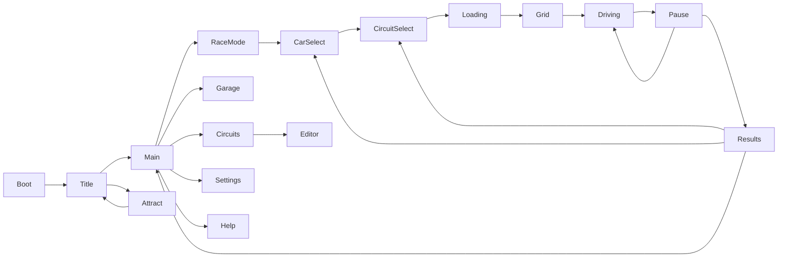

# PS2 reference study and Spa acceptance log

Research started 2026-09-21, before changing the follow-up renderer. The target is the output and presentation of a 2003–2006 console racer, with original content. Reference pictures are study material only: `reference/` is ignored by Git and excluded by the export preset. No reference pixels, game fonts, logos, sounds or extracted meshes are used as assets.

## Sources and findings

- [GT4 US instruction manual, Sony/Polyphony, pp. 6–15 and 30–31](https://db.hfsplay.fr/files/2019/12/02/Gran_Turismo_4_USA_teBOv76.pdf): separates the opening/title, mode selection, course/car choice and race menu. Its options explicitly offer 4:3/16:9, normal/progressive 480p/HDTV 1080i, picture adjustment, menu sound levels and demo timing. These are output choices, not evidence of a full 1920×1080 raster. The manual is the primary basis for the flow conventions, not copied wording or screen art.
- [ps2tek, original hardware reverse-engineering documentation](https://psi-rockin.github.io/ps2tek/): the GS has 4 MB shared local memory for colour, depth and textures. Texture coordinates support perspective correction. Colour/index formats and CLUT changes are explicit hardware operations. A texture budget is not the same as all game assets fitting simultaneously in 4 MB: streaming and buffer reuse matter.
- [ps2dev gsKit display/texture implementation](https://github.com/ps2dev/gsKit/tree/master/ee/gs) and [PCSX2 GS register definitions](https://github.com/PCSX2/pcsx2/blob/master/pcsx2/GS/GSRegs.h): frame/field output, programmable dithering, mip-level registers and indexed formats are separate controls. PS2 supports 16/24/32-bit colour and 4/8-bit palette indices; universal RGB565 plus Bayer noise is not a faithful platform rule. No code is copied from either project.
- [GT4 official product gallery](https://www.gran-turismo.com/us/products/gt4/): primary visual reference for muted grass, dark vegetation, local contrast, bright car reflection bands and restrained trackside geometry. Gallery contains gameplay, replay/photo presentation and packaging; they are labelled separately below. A high-quality replay still is not evidence of identical gameplay post-processing.
- [Godot 4.6 SubViewport](https://docs.godotengine.org/en/4.6/classes/class_subviewport.html) and [Viewport](https://docs.godotengine.org/en/4.6/classes/class_viewport.html): offscreen rendering requires explicit presentation and input forwarding. The editor must retain independent native input/rendering. Avoid effects requiring Forward+-only compositor APIs so the same output filter works in OpenGL.
- [Rajdhani upstream](https://github.com/itfoundry/rajdhani): squared, condensed, slightly rounded screen lettering. This is a modern OFL font selected for compatible visual character, not a font extracted from a PS2 game.
- [Sony's GT5 Spa announcement, 2011](https://blog.playstation.com/2011/10/11/gran-turismo-5-spec-2-0-update-is-live-dlc-coming-october-18th/): Spa is later-series content. Comparisons use analogous GT4 circuit views and NFSU2 night-road views; they must not be labelled as GT4 Spa screenshots.

## Concrete rendering targets

| Topic | Research conclusion and implementation target |
|---|---|
| Raster/output | Use a 640×448 storage raster for the SD mode, with 4:3 or anamorphic widescreen presentation. 512×448 is another period working width, not a universal GS limit. Retain 720p/Native as enhanced options. Treat 480p component as the clean default. Do not claim a 1080i signal is native full-HD shading. |
| Fields | A 480i option must generate alternating 224-line fields, preserve the other field from the preceding instant, apply a vertical deflicker kernel and show motion combing. Dark stripes painted over an unchanged progressive image are insufficient. The nominal 448 active game lines sit within the television signal's timing/overscan. |
| Colour | Default component preserves 24-bit output. Optional 16-bit framebuffer treatment uses RGB555, distinct from 16/256-entry texture palettes. Dither is small and tied to the reduced-precision mode. Do not force every clean sky to exhibit RGB565 banding. |
| Composite/CRT | Model reduced chroma bandwidth separately from luma, mild horizontal bleed, a restrained phosphor mask and adjustable-looking contrast. This is an output approximation, not a claim of electrical NTSC waveform emulation or a single universal CRT gamma. Avoid heavy scanline darkness that makes 16 px text unreadable. |
| Textures | Build indexed 16- and 256-colour PNGs at 128/256 pixels where useful; quantize continuous maps to RGB555. Preserve originals and record palette counts/hashes. Godot expands indexed PNGs for the modern GPU; the appearance/budget is intentional, not a claim that it uses GS CLUT hardware. Use bilinear filtering. Mips existed on PS2 and use varied by game/material; use restrained mip chains on roads/foliage, not a blanket no-mip rule. |
| Geometry | Use a working main-car budget of a few thousand to roughly ten thousand triangles, then measure this model. Published unsourced polygon counts conflict and do not establish an exact GT4 budget. Keep the procedural 296; remove unnecessary repeated detail through LOD before sacrificing silhouette. Log submitted scene primitives rather than inventing a universal scene count. |
| Lighting | Vertex lighting plus broad environment reflection bands and a moving specular highlight, dark reflective glass, coherent sky/ground colours. Afternoon bright areas should bloom locally without bleaching the full road. |
| Night effects | Study broad amber/white light bleed, dark reflective wet roads, elongated highlights, coloured lamps and stronger high-speed image persistence in NFSU2. These observations do not prove a particular proprietary shader implementation. Add subtle distant heat shimmer only where it helps the reference, not as a universal PS2 artefact. |
| Shadows/fog | Road-following car projection, baked contact darkening and limited optional maps. Blend the fog colour into a textured horizon; abrupt card LODs can remain, but empty scenery bands and uniform coloured ground cannot stand in for finished circuits. |
| UI | 448-line design, minimum ordinary text about 16 internal pixels, generous safe margins, compact tab/row groups, a persistent bottom prompt strip, visible focus, brief fades/slides and distinct synthesized navigation sounds. Authentic UI joins the output chain; Sharp UI is optional; editor stays native. |

Exact GT4 car/scene triangle counts, proprietary bloom kernels, per-track texture residency and original sound envelopes have not been established from primary technical material. They remain comparison targets, not asserted facts. Field rendering and the display filter will be documented with their actual implementation rather than described as bit-exact emulation.

## Downloaded reference inventory

All game imagery remains copyrighted by its owners. Local study only; no redistribution license is claimed. See THIRD-PARTY.md for the download ledger.

| Local file | Source / author | Classification |
|---|---|---|
| `reference/gt4-i1c3MFDfQ79NhhH.jpg` | [Official gallery image](https://www.gran-turismo.com/images/c/i1c3MFDfQ79NhhH.jpg), Sony/Polyphony | 640×480 B-Spec gameplay with circuit, car and HUD; principal daylight reference |
| `reference/gt4-i10GQfUKsQ0P5uB.jpg` | [Official gallery image](https://www.gran-turismo.com/images/c/i10GQfUKsQ0P5uB.jpg), Sony/Polyphony | Replay/photo action still; paint/contrast only, not a gameplay blur benchmark |
| `reference/gt4-i1iFqNSWI9TiauH.jpg` | [Official gallery image](https://www.gran-turismo.com/images/c/i1iFqNSWI9TiauH.jpg), Sony/Polyphony | Photo-mode UI, layout/prompt study |
| `reference/gt4-i13rs98WqPO86EE.jpg` | [Official gallery image](https://www.gran-turismo.com/images/c/i13rs98WqPO86EE.jpg), Sony/Polyphony | Packaging; excluded from visual comparisons |
| `reference/gt4-title.png` | [Retroplace PS2 entry](https://www.retroplace.com/en/games/75977--gran-turismo-4), game artwork Sony/Polyphony | Title-screen layout reference, capture provenance not independently established |
| `reference/nfsu2-road.jpg` | [PS Parts PS2 entry](https://www.psparts.nl/product/2740437/need-for-speed-underground-2-ps2-art-400410), game artwork EA Black Box | Night road/HUD reference; storefront identifies PS2, capture settings unknown |
| `reference/nfsu2-night.jpg` | [WhichCar retrospective](https://www.whichcar.com.au/advice/playstation-2-turns-20-the-best-ps2-driving-games), game artwork EA Black Box | Night colour/reflection reference; hardware provenance unknown |

Reference provenance is part of the evidence: storefront/editorial pictures cannot establish exact PS2 raster dimensions or validate a claim of pixel-exact hardware matching. Comparison sheets label this limitation.

Direct downloaded image URLs for the three non-gallery entries: [Retroplace title](https://www.retroplace.com/pics/ps2/titles/75977--gran-turismo-4.png), [PS Parts road](https://primary.jwwb.nl/public/l/i/d/temp-pyvyqhodlppqvcjhkezb/z87ync/2NeedforSpeedUnderground2.jpg), and [WhichCar night](https://media.whichcar.com.au/uploads/2025/02/ec2e69a6-PS2-games-nfsu2.jpg). These files remain study-only and git-ignored.

## Front-end flow

Every non-driving page also has Back; editor exits retain the dirty-document guard. Loading progress must reflect completed work, not elapsed time. Attract mode and replay are presentation consumers of the existing car/ghost contract.

## Comparison rounds and acceptance

### Round 1 — initial 448-line frontend and output conversion

Captured 72 images in `tests/compare/round-1/forward`. Inspection against the official GT4 gameplay and photo UI references found flat, uniform road/grass, noisy procedural foliage, an overly plain painted sky, weak car reflection structure and dim aid labels. SD raster and readable menu scale were in place, but the modal prompt strip was obscured. The run also exposed two capture errors: a nonexistent grid-distance field and deferred focus calls on deleted buttons. Its empty screenshot-failure array did **not** establish a clean run; stderr contained those errors.

Changes for round 2: correct the grid origin and defer focus through a live owner; replace flat terrain shading with the existing CC0 surface photographs; build 16/256-colour and RGB555 texture outputs; introduce licensed sky/needle photographs. The screenshots remain as the before set.

### Round 2 — palette textures and photographic detail

Captured all 72 images without stderr errors. Inspected Eau Rouge chase, Kemmel night hood, Settings and both reference lighting images at full size. Ground detail improved, but grass/gravel were too bright, the pine card was brown, night asphalt remained too blue/uniform, and the HDR conversion had turned the sky black. This was a build defect, not an intentional night-grade choice. The settings sheet left unused space and its prompt strip remained dim.

Changes for round 3: unpack HDR to floating-point RGB before resize; retain cloud luminance and a separate night grade; grade pine needles green; tone down ground colours; preserve night asphalt texture and strengthen elongated authored lamp reflections. Add original wire fencing, mip chains, a high-contrast aid panel, a foreground prompt strip on every frontend screen, expanding settings content, brief menu fades and device-independent controller bindings. Reuse the car meshes on restart to avoid unnecessary mesh construction at the loading stage.

### Round 3 — full set and additional output modes

Captured 80 images with empty stderr: eight positions, two cameras and lighting presets, three showroom angles, every frontend/editor page at both required sizes, and 480i/composite/Sharp UI/4:3 output checks. The contact sheets show restored clouds, coherent foliage, more convincing colour and fencing. The aid panel and prompt strip are readable. Remaining differences: the track is cleaner and less densely dressed than the GT4 reference, night lamp pools need a more broken reflective surface, and spec/map labels are too exposed over the moving car. The loading/results captures need real preparation/recorded lap content rather than empty staging. The 296 measured 21,498 mesh triangles, above the chosen working budget; much of that is sub-pixel wheel tessellation.

Changes for the next capture: dark backing for car/circuit data and map, narrower circuit button to clear the map, fill settings content vertically, preserve a real completed lap for time sheet/replay captures, reduce wheel torus/cylinder and crown subdivisions while preserving the animation contract. Correct flare/debug projection for anamorphic pixels. Restore Esc returning from editor test drive, caught by the regression suite. Both input-only flow laps now pass with zero off-track steps/contacts and empty stderr (74 checks); source/export and performance acceptance remain pending.

### Round 4 — geometry, readability and backend comparison

Both backends produced 80 captures each with empty stderr. The 296 is now 11,546 mesh triangles. Full-size circuit/results screens are readable, but proportional spacing misaligned the result columns. The output-mode captures retained stale editor/HUD state because the capture runner had disabled normal UI processing. OpenGL terrain was conspicuously yellow; its sRGB arithmetic differed from Forward+. Night road breakup appeared as regular horizontal stripes.

Changes: align time-sheet columns by explicit positions; explicitly synchronize the staged UI before output captures; perform terrain colour arithmetic in linear space under both backends; replace sinusoidal reflection stripes with texture-derived breakup. Fade sub-pixel fence wires and interpolate the visual runoff mask edge without changing the underlying physics paint cells.

### Round 5 — full visual inspection and frame-time diagnosis

Both backends again produced all 80 captures with empty stderr. Inspected all Afternoon/Afterhours locations and showroom angles, all 19 UI/editor pages at both 1280×800 and 1920×1080, and the output variants. The CRT/480i screen now contains the intended frontend; grass colour is substantially closer across backends; result columns line up. Remaining presentation defects were weak point-light halos, missing mouse Pause/Back on transient screens and static capture telemetry showing first gear at Kemmel speed.

The first full-lap timing run failed: Forward+ SD Afternoon averaged 5.91 ms but its slowest 1% averaged 35.25 ms, with a 172.99 ms finish-line frame. Per-frame CPU/GPU traces located daytime stalls in repeated flare terrain projections, and the finish-line cost in deep copying and record persistence. Replacing the flare queries with the cached rendered heightfield and transferring immutable recordings to a serial background writer reduced the same diagnostic to 4.94 ms average / 7.46 ms slowest 1% / 10.35 ms maximum, with zero frames over 16.667 ms. The failure is retained as evidence, not omitted from acceptance history.

### Round 6 — final presentation matrix

Both backends captured all 80 images with empty stderr. Added original camera-facing lamp halos/streaks; partitioned terrain into static 24-cell tiles and repeated scenery into 128 m batches so off-screen geometry is culled; reduced redundant tyre-wall cylinder rings. No geometry is rebuilt at a LOD boundary. Board colours are deterministic. The final screenshots include legible aid states and tyre units, mouse Pause, loading/grid Back, corrected staged gear/RPM and a populated time sheet. Inspected night Eau Rouge/Kemmel, daylight La Source, loading, both complete frontend contact-sheet sets, all showroom angles and the paired scene sheets. Screenshots are staged poses, not proof of dynamic lap validity; the separate input/lap tests provide that evidence.

Timing also exposed 49–50 ms circuit validation during preparation. A spatial candidate search preserves the original strict intersection predicate and agrees with its exhaustive implementation on 103 deterministic cases, including crossings, collinear spans, shared endpoints and randomized layouts. The selected record is reused when starting a session. Preparation reports real per-stage work rather than a fake progress timer, and cancelling cannot resurrect a suspended load.

Final test/performance tables and the ranked remaining authenticity differences are in [PS2-FOLLOWUP-REPORT.md](PS2-FOLLOWUP-REPORT.md). A reference-image match is a visual judgment, not evidence of bit-exact GS/CRT emulation.

The subsequent full OpenGL trace caught a 165 ms first-use frame exactly when the saved ghost became visible at the start line, while solver/presentation work stayed below 3 ms. [Godot's pipeline compilation guide](https://docs.godotengine.org/en/4.6/tutorials/performance/pipeline_compilations.html) explains Compatibility's first-use limitation. The application now renders the real ghost meshes and a skid MultiMesh once into a tiny offscreen viewport during menu preparation and lighting changes, with the normal camera excluding that layer until the draw completes. The same SD Afternoon diagnostic then measured 6.48 ms average, 9.02 ms slowest-1% mean and 11.04 ms maximum, with zero over-budget frames. The diagnosis is an inference from the trace/visibility transition and follow-up improvement; `tests/showcase/prewarm-before` retains the earlier matrix/traces. This does not claim to control unrelated Windows scheduling.

### Rounds 7 and 8 — wet-road breakup and exact colour transfer

An asset audit found only two near-white levels in the quantized asphalt roughness map, making it ineffective as a reflection mask. Round 7 replaced that mask with contrast-expanded asphalt albedo luminance and a narrower longitudinal reflection. Both backends captured 80 images with empty stderr. Full-size Eau Rouge/Kemmel/Bus Stop inspection showed improved streaks but excessive Forward+ brightness compared with OpenGL: the approximate 2.2 conversion differed significantly from the actual sRGB transfer at these dark texture values.

Round 8 uses the piecewise sRGB transfer for the Compatibility mask samples and converts only the authored reflection emission back to its output colour space. Both 80-image runs have empty stderr. Full-size paired Eau Rouge views now show comparable broken amber highlights rather than a broad uniform wash; Kemmel, Bus Stop and the complete contact sheets retain readable road edges and HUD. The geometry, UI layout and physics are unchanged from round 6. The report links this final matrix. Session-history review separately fixed a zero-time result row after changing a completed run's record selection; the feature suite checks it after checking replay immutability.
